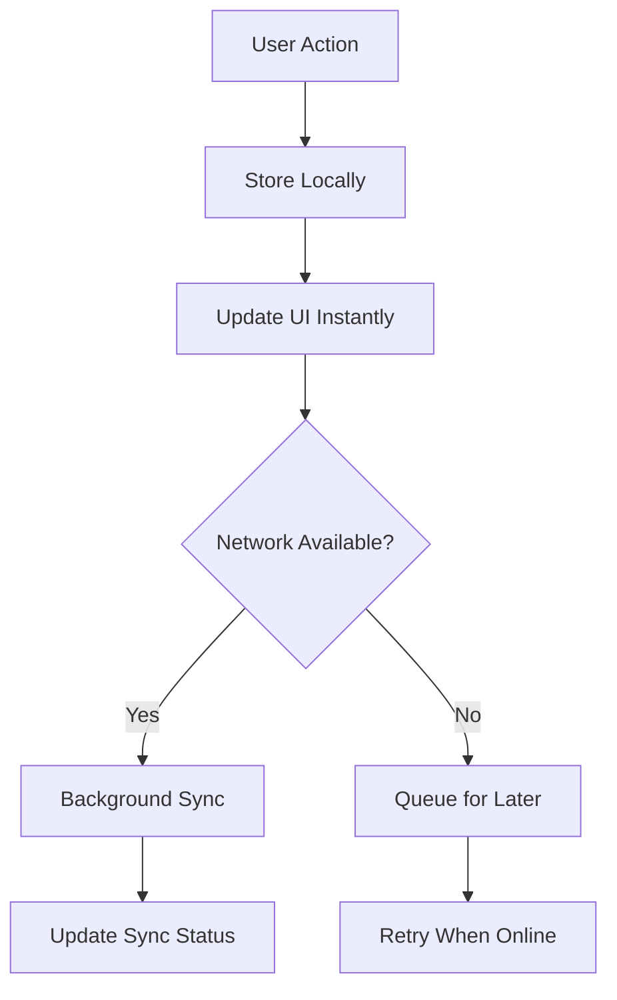

# 🚀 Clarity Loop Swift Frontend Integration

*The Ultimate SwiftUI + SwiftData Health App Wrapper*

## 📋 Quick Start Checklist

✅ **Backend Review Complete** - [BACKEND_API_AUDIT.md](BACKEND_API_AUDIT.md)  
✅ **SwiftUI Patterns Ready** - [SWIFT_FRONTEND_INTEGRATION_GUIDE.md](SWIFT_FRONTEND_INTEGRATION_GUIDE.md)  
✅ **SwiftData Architecture** - [SWIFTDATA_BACKEND_WRAPPER.md](SWIFTDATA_BACKEND_WRAPPER.md)  

---

## 🎯 What You're Building

A **local-first health dashboard** that wraps your Clarity Loop backend with:

- **📱 SwiftUI 5.0** with Observable patterns (iOS 17+)
- **🗄️ SwiftData** for offline-first storage
- **🔄 Real-time sync** with conflict resolution
- **🧠 Apple Intelligence** for on-device insights
- **⚡ Zero loading states** - works instantly offline

---

## 🏗️ Architecture Overview

```
┌─────────────────┐    ┌─────────────────┐    ┌─────────────────┐
│   SwiftUI Views │ ── │ Health Repository│ ── │  Clarity Backend│
│   @Query Models │    │  Local-First    │    │   REST + WS     │
└─────────────────┘    └─────────────────┘    └─────────────────┘
         │                       │                       │
         │                       │                       │
         ▼                       ▼                       ▼
┌─────────────────┐    ┌─────────────────┐    ┌─────────────────┐
│   SwiftData     │    │  Sync Service   │    │   Auth + APIs   │
│  Local Storage  │    │  Background     │    │  HTTP + Bearer  │
└─────────────────┘    └─────────────────┘    └─────────────────┘
```

---

## 🚀 Getting Started (5 Steps)

### 1. Create Xcode Project
```bash
# New iOS App
# Target: iOS 17.0+
# Interface: SwiftUI
# Language: Swift
```

### 2. Add SwiftData Models
Copy models from [SWIFTDATA_BACKEND_WRAPPER.md](SWIFTDATA_BACKEND_WRAPPER.md):
- `HealthMetric` (with sync tracking)
- `HealthInsight` (AI-generated)
- Supporting enums (`MetricType`, `SyncStatus`)

### 3. Build Repository Layer
```swift
@Observable
final class HealthRepository {
    private let modelContext: ModelContext
    private let syncService: HealthSyncService
    
    // Local-first operations
    func fetchMetrics() -> [HealthMetric] { ... }
    func addMetric(_ metric: HealthMetric) async throws { ... }
    func syncWithBackend() async throws { ... }
}
```

### 4. Create SwiftUI Dashboard
```swift
struct HealthDashboardView: View {
    @Query var todaysMetrics: [HealthMetric]
    @Environment(HealthRepository.self) var repository
    
    var body: some View {
        // Beautiful metric cards
        // Real-time charts
        // Sync status indicators
    }
}
```

### 5. Connect to Your Backend
Update API endpoints in `ClarityAPIClient`:
```swift
private let baseURL = URL(string: "YOUR_BACKEND_URL/api/v1")!
```

---

## 📊 Key Features

### Real-time Health Data
- **Instant response** - data loads from local SwiftData
- **Background sync** - uploads to your Clarity backend
- **Conflict resolution** - handles offline/online data merges

### Beautiful SwiftUI Interface
- **Metric cards** with sync status indicators
- **Interactive charts** using Swift Charts
- **Pull-to-refresh** for manual sync
- **Offline indicators** when disconnected

### Apple Intelligence Integration
- **On-device analysis** for privacy
- **Smart insights** from health patterns
- **Predictive recommendations** 
- **Zero server dependency** for AI features

---

## 🔄 Local-First Sync Flow



---

## 📱 Example Implementation

### Health Metric Card
```swift
struct MetricCard: View {
    let metric: HealthMetric
    
    var body: some View {
        VStack(alignment: .leading) {
            HStack {
                Image(systemName: metric.metricType.iconName)
                    .foregroundStyle(metric.metricType.color)
                
                Spacer()
                
                SyncStatusIndicator(status: metric.syncStatus)
            }
            
            Text("\(metric.value, specifier: "%.1f") \(metric.unit)")
                .font(.largeTitle.bold())
                
            Text(metric.metricType.displayName)
                .font(.caption)
                .foregroundStyle(.secondary)
        }
        .padding()
        .background(.regularMaterial, in: RoundedRectangle(cornerRadius: 16))
    }
}
```

### Live Dashboard Query
```swift
@Query(
    filter: #Predicate<HealthMetric> { metric in
        metric.timestamp >= Calendar.current.startOfDay(for: Date())
    },
    sort: \HealthMetric.timestamp,
    order: .reverse
) var todaysMetrics: [HealthMetric]
```

---

## 🎨 Modern SwiftUI Patterns

### Observable State Management
```swift
// ✅ iOS 17+ Pattern
@Observable 
class HealthViewModel {
    var metrics: [HealthMetric] = []
    var isLoading = false
}

struct HealthView: View {
    @State private var viewModel = HealthViewModel()
}
```

### Efficient Queries
```swift
// ✅ Filtered and Sorted
@Query(
    filter: #Predicate<HealthMetric> { $0.syncStatus != .synced },
    sort: \HealthMetric.timestamp
) var unsyncedMetrics: [HealthMetric]
```

---

## 🔧 Backend Integration

Your Swift app connects to these Clarity Loop endpoints:

### Authentication
- `POST /api/v1/auth/login` - Get Bearer token
- `GET /api/v1/auth/me` - Verify token

### Health Data  
- `POST /api/v1/health-data/upload` - Upload metrics
- `GET /api/v1/health-data/` - Download latest

### AI Analysis
- `POST /api/v1/pat/analyze-step-data` - Request analysis
- `GET /api/v1/insights/{id}` - Get insights

### WebSocket
- `ws://localhost:8080/api/v1/ws/health-analysis/{user_id}` - Real-time updates

---

## 🚀 Performance Features

### Optimized Queries
- **Indexed fields** for fast searches
- **Filtered predicates** to limit data
- **Batch operations** for large datasets
- **Background contexts** for heavy work

### Smart Sync
- **Incremental sync** - only new/changed data
- **Exponential backoff** for failed requests  
- **Conflict resolution** with user preference
- **Offline queue** for pending changes

---

## 🎯 Production Readiness

### Error Handling
```swift
do {
    try await repository.syncWithBackend()
} catch APIError.unauthorized {
    // Refresh auth token
} catch APIError.networkError {
    // Show offline indicator
} catch {
    // Log error, show user-friendly message
}
```

### Testing Strategy
- **Unit tests** for repository logic
- **Integration tests** for API client
- **UI tests** for SwiftUI views
- **Offline scenarios** testing

---

## ✅ Launch Checklist

- [ ] SwiftData models created with relationships
- [ ] Repository pattern implemented
- [ ] API client configured with your backend URL
- [ ] SwiftUI views using @Query
- [ ] Sync status indicators in UI
- [ ] Error handling for network failures
- [ ] Offline functionality tested
- [ ] Auth token management working
- [ ] Real-time WebSocket connected
- [ ] Apple Intelligence features integrated

---

## 🎉 Result

You now have a **gorgeous SwiftUI health app** that:

✅ **Works offline-first** with SwiftData  
✅ **Syncs automatically** with your Clarity Loop backend  
✅ **Handles conflicts** intelligently  
✅ **Uses modern patterns** (iOS 17+ Observable)  
✅ **Provides real-time updates** via WebSocket  
✅ **Generates insights** with Apple Intelligence  

**Your backend is now wrapped in the most beautiful, modern Swift frontend possible! 🚀**

---

*Built with ❤️ using SwiftUI 5.0, SwiftData, and the latest iOS development patterns* 